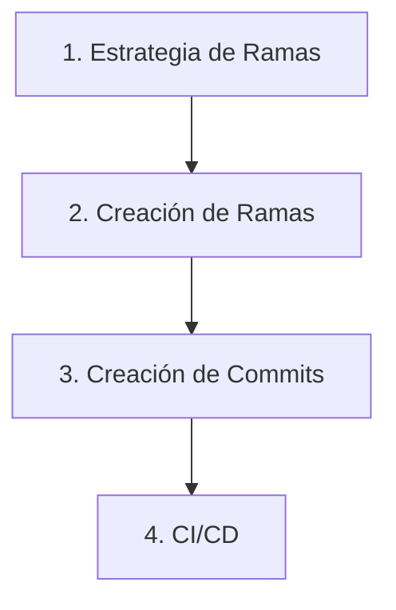

## 🔹 1. Código de Conducta

- Trata a los demás con respeto y profesionalismo.
- Acepta críticas constructivas de manera positiva.
- Enfócate en lo mejor para el proyecto.

## 🔹 2. Flujo de Trabajo

Este proyecto proporciona un flujo de trabajo completo para implementar mejores prácticas en el desarrollo colaborativo de software. Combina metodologías probadas de gestión de código fuente, convenciones de commits estandarizadas y automatización de CI/CD para crear un flujo de trabajo coherente y escalable.

Para comprender e implementar correctamente este flujo de trabajo, es importante seguir las guías en el orden indicado. Cada paso construye sobre el anterior: primero entenderás la estrategia de ramas que define cómo organizar el trabajo, luego aprenderás las convenciones para nombrar ramas y escribir commits, y finalmente configurarás la automatización que aprovecha todo lo anterior.



### Paso 1: Estrategia de Ramas

Comprende la estructura de ramas del proyecto y las estrategias de merge. Este es el fundamento de todo el flujo de trabajo.

📖 **[Estrategia de Ramas →](workflow/branching_strategy.md)**

### Paso 2: Creación de Ramas de Trabajo

Aprende a crear ramas de trabajo siguiendo las convenciones establecidas.

📖 **[Creación de Ramas →](workflow/create_branch.md)**

### Paso 3: Creación de Commits

Implementa convenciones de `commits` que permitan automatizar el versionado y la generación de `changelogs`.

📖 **[Creación de Commits →](workflow/create_commit.md)**

## 🔹 3. Validación Automática

Este proyecto utiliza **pre-commit** para configurar Git hooks que validan automáticamente el cumplimiento de las reglas del flujo de trabajo. Para activar los hooks, ejecuta el siguiente comando después de instalar las dependencias del proyecto:

```txt
pre-commit install
```

Una vez configurado, los hooks se ejecutarán antes de cada commit para verificar la calidad del código:

- **Ruff:** Analiza y formatea el código automáticamente, asegurando el cumplimiento de las reglas de estilo y detectando errores comunes.
- **Mypy:** Verifica el tipado estático del código, garantizando que las anotaciones de tipos sean correctas y consistentes.

Si alguna de estas validaciones falla, el commit será rechazado hasta que se corrijan los problemas detectados. También puedes ejecutar estas herramientas de forma manual en cualquier momento:

### 3.1. Ruff

```txt
# Verificar errores de linting
ruff check .

# Corregir automáticamente los errores de linting
ruff check . --fix

# Formatear el código automáticamente
ruff format .
```

### 3.2. Mypy

```txt
# Verificar el tipado estático del código
mypy .
```

## 🔹 4. Asistente de Commits

El comando `cz commit` utiliza **Commitizen** para guiarte paso a paso en la creación de commits:

```txt
cz commit
```

El asistente te hará las siguientes preguntas:

1. **Tipo de cambio:** Selecciona el prefijo del commit.
2. **Scope (opcional):** Indica el ámbito o área del cambio.
3. **Descripción:** Escribe una descripción corta e imperativa del cambio.
4. **Descripción detallada (opcional):** Agrega contexto adicional si es necesario.
5. **Breaking Change (opcional):** Indica si el cambio rompe compatibilidad.

La configuración del asistente se encuentra en el archivo `pyproject.toml`, dentro de la sección `[tool.commitizen.customize]`, donde se definen los tipos de cambio permitidos, las preguntas del flujo interactivo y el formato del mensaje de commit.

> [!IMPORTANT]
> El scope debe seguir reglas específicas de formato. Consulta la sección **[6. Scope](workflow/create_commit.md#-6-scope)** en la guía de commits para conocer todas las reglas.