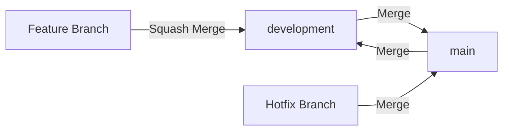

# 🔹 Estrategia de Ramas

Este documento describe la estrategia de branching de un proyecto, incluyendo las ramas principales y las estrategias de merge para cada tipo de Pull Request. Esta estrategia es compatible con las principales plataformas de gestión de repositorios como **GitHub** y **GitLab**, ya que ambas ofrecen las opciones de merge necesarias para implementarla correctamente.

## 🔹 1. Ramas Principales

El proyecto mantiene **dos ramas principales** en todo momento:

| Rama | Propósito | Estrategia de Merge |
|------|-----------|---------------------|
| `main` | Producción | Merge |
| `development` | Desarrollo | Squash Merge |

> [!IMPORTANT]
> Estas ramas son protegidas. Todos los cambios deben integrarse mediante Pull Requests.

## 🔹 2. Estrategias de Merge

### 2.1. PR hacia development

Todas las Pull Requests que tienen como destino `development` deben aceptarse usando **squash merge**.

**¿Por qué squash?**
- Combina todos los commits de la rama en un único commit.
- El mensaje final debe usar un prefijo reservado (`feat`, `fix`, `perf`).
- Mantiene el historial de `development` limpio y organizado.

```txt
# Commits en la feature branch
add(auth): Modelo de usuario
add(auth): Servicio de autenticación
add(auth): Endpoint de login
test(auth): Tests unitarios

# Resultado del squash merge en development
feat(auth): Sistema de autenticación con JWT
```

### 2.2. PR hacia main

Todas las Pull Requests que tienen como destino `main` deben aceptarse usando **merge** (forma tradicional), sin importar si el origen es `development` o una rama de hotfix.

**¿Por qué merge?**
- Preserva todos los commits individuales.
- Cada commit con prefijo reservado (`feat`, `fix`, `perf`) es necesario para el versionado semántico automático.
- Mantiene la trazabilidad completa del historial en producción.

> [!IMPORTANT]
> No usar squash en PRs hacia `main`. El versionado automático depende de cada commit individual para generar las release notes y calcular la versión.

## 🔹 3. Flujo de Trabajo



### 3.1. Desarrollo de funcionalidades, correcciones o cualquier tipo de cambio

1. Crear rama desde `development`.
2. Desarrollar usando commits con prefijos `add`, `wip`, `test`, etc.
3. Crear PR hacia `development`.
4. Aceptar con **squash merge** usando prefijo reservado.

### 3.2. Promoción a Producción

1. Crear PR desde `development` hacia `main`.
2. Aceptar con **merge**.
3. El versionado automático procesa cada commit.
4. Sincronizar `development` con `main` (ver sección 3.4).

### 3.3. Correcciones rápidas a producción

1. Crear rama desde `main`.
2. Aplicar la corrección.
3. Crear PR hacia `main`.
4. Aceptar con **merge**.
5. Sincronizar `development` con `main` (ver sección 3.4).

### 3.4. Sincronización de development

Después de cada merge hacia `main` (ya sea por promoción o por hotfix), es necesario sincronizar `development` para que refleje el estado actual de producción.

1. Crear PR desde `main` hacia `development`.
2. Aceptar con **merge**.

> [!IMPORTANT]
> Este paso es fundamental para evitar conflictos y garantizar que `development` siempre parta de una base actualizada con producción.